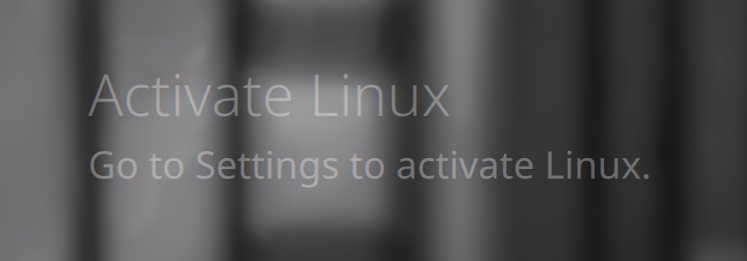

# Activate Linux Watermark

Display Windows-style "Activate Linux" watermark on your desktop.



## Install

Use the DMS CLI:
```bash
dms plugins install activateLinux
```

Or manually:
```bash
git clone https://github.com/hthienloc/dms-activate-linux ~/.config/DankMaterialShell/plugins/activateLinux
```

## Features

- **Desktop watermark** - Semi-transparent overlay in bottom-right corner
- **Customizable text** - Toggle custom first/second line in settings

## Usage

| Action | Result |
|--------|--------|
| Left click | Open settings |

## License

MIT

## Roadmap / TODO

- [ ] **Flexible Positioning**: Choose any corner or center of the screen for the watermark.
- [ ] **Appearance Controls**: Fine-grained sliders for opacity, font weight, and custom HEX colors.
- [ ] **Dynamic Variables**: Placeholders for `{distro}`, `{kernel}`, and `{uptime}` in the watermark text.
- [ ] **Multi-Monitor Support**: Toggle visibility independently across connected displays.
- [ ] **Style Presets**: Authentically modeled presets for Windows 10/11 and classic system watermarks.
- [ ] **Non-Interactive Mode**: Ensure full input click-through so it never interferes with desktop usage.


## Translations

<!-- TRANSLATIONS_TABLE_START -->
| Language | Locale | Progress | Coverage | Status |
| :--- | :--- | :---: | :---: | :---: |
| Arabic | `ar` | 16/16 | 100.0% | 🟢 Complete |
| Bulgarian | `bg` | 16/16 | 100.0% | 🟢 Complete |
| German | `de` | 16/16 | 100.0% | 🟢 Complete |
| Esperanto | `eo` | 16/16 | 100.0% | 🟢 Complete |
| Spanish | `es` | 16/16 | 100.0% | 🟢 Complete |
| Persian | `fa` | 16/16 | 100.0% | 🟢 Complete |
| French | `fr` | 16/16 | 100.0% | 🟢 Complete |
| Hebrew | `he` | 16/16 | 100.0% | 🟢 Complete |
| Hungarian | `hu` | 16/16 | 100.0% | 🟢 Complete |
| Italian | `it` | 16/16 | 100.0% | 🟢 Complete |
| Japanese | `ja` | 16/16 | 100.0% | 🟢 Complete |
| Korean | `ko` | 16/16 | 100.0% | 🟢 Complete |
| Dutch | `nl` | 16/16 | 100.0% | 🟢 Complete |
| Polish | `pl` | 16/16 | 100.0% | 🟢 Complete |
| Portuguese | `pt` | 16/16 | 100.0% | 🟢 Complete |
| Russian | `ru` | 16/16 | 100.0% | 🟢 Complete |
| Swedish | `sv` | 16/16 | 100.0% | 🟢 Complete |
| Turkish | `tr` | 16/16 | 100.0% | 🟢 Complete |
| Ukrainian | `uk` | 16/16 | 100.0% | 🟢 Complete |
| Vietnamese | `vi` | 16/16 | 100.0% | 🟢 Complete |
| Chinese (Simplified) | `zh_CN` | 16/16 | 100.0% | 🟢 Complete |
| Chinese (Traditional) | `zh_TW` | 16/16 | 100.0% | 🟢 Complete |
<!-- TRANSLATIONS_TABLE_END -->
