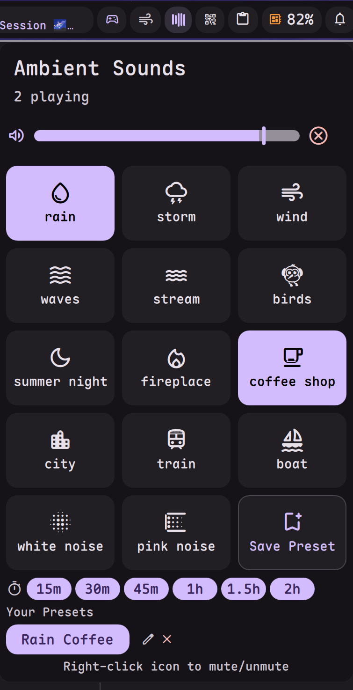

# Ambient Sound

Play ambient sounds for focus and relaxation.



## Requirements

- `mpv` (recommended) or `ffplay` - Audio player for sound playback
- `socat` - Runtime volume control when using mpv

## Install

Use the DMS CLI:
```bash
dms plugins install ambientSound
```

Or manually:
```bash
git clone https://github.com/hthienloc/dms-ambient-sound ~/.config/DankMaterialShell/plugins/ambientSound
```

## Features

- **24 built-in sounds** - Rain, storm, wind, waves, fireplace, city, etc.
- **Mix & match** - Play multiple sounds simultaneously
- **Presets** - Save and load your favorite sound combinations
- **Sleep timer** - Auto-stop with configurable actions (mute, lock, suspend)
- **Middle-click Preset** - Configure a favorite sound to toggle instantly with a middle-click

## Usage

| Action | Result |
|--------|--------|
| Left click | Open sound mixer |
| Middle click | Toggle selected preset sound |
| Right click | Mute/unmute |

## License

GPL-3.0

## Credits

Sound assets and inspiration sourced from:
- [Blankie](https://github.com/codybrom/Blankie)
- [Blanket](https://github.com/rafaelmardojai/blanket)

## Roadmap / TODO

- [ ] **MPRIS Integration**: Control playback and volume from system media controllers.
- [ ] **Cross-fade Transitions**: Smoothly fade sounds in and out when switching presets or stopping.
- [x] **Custom Sound Support**: Ability to add personal `.ogg` or `.mp3` files to a user-defined folder.
- [ ] **Environmental Effects**: Basic filters (e.g., "Muffled/Behind Wall" effect) using mpv's audio filters.
- [ ] **Advanced Scheduling**: Set timers or calendar-based triggers to auto-start specific soundscapes.
- [ ] **Dynamic Soundscapes**: Sounds that vary slightly over time to prevent "loop fatigue."
