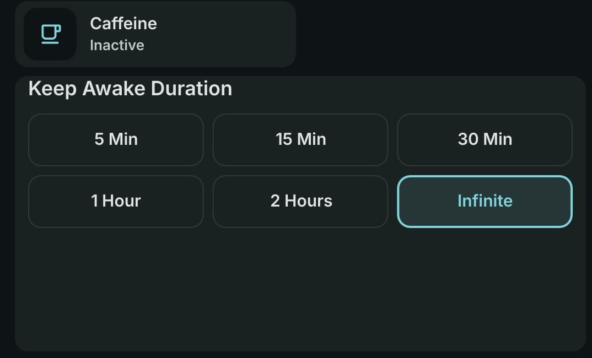

# Caffeine

Keep your screen awake and prevent idle sleep with a single click on your DankBar.



## Install

Use the DMS CLI:
```bash
dms plugins install caffeine
```

Or manually:
```bash
git clone https://github.com/hthienloc/dms-caffeine ~/.config/DankMaterialShell/plugins/caffeine
```

## Features

- **DankBar Widget**: Click the coffee icon pill to manage screen stay-awake / sleep inhibition.
- **Control Center Integration**: View active status/remaining time and quickly select presets or custom durations from the Control Center.
- **Timed Caffeine**: Choose from predefined presets or enter a custom duration (in minutes).
- **App Automation**: Auto-activate when specific media players or meeting tools are open.
- **Full Screen Awareness**: Automatically stay awake when any window is full-screen.
- **Battery Integration**: Automatically disable stay-awake when battery level drops below a configurable threshold to save power.
- **Deactivate on Manual Lock**: Disable stay-awake automatically if the screen is locked manually.

## Usage

| Action | Result |
|--------|--------|
| Left click | Open the duration picker popout (select presets or enter custom minutes) |
| Right click | Quick toggle stay-awake (activates with default duration, or deactivates/resets if active) |

## TODO / Roadmap

- [x] **Timed Caffeine:** Predefined timers or custom duration options.
- [x] **Status Indicator:** Show remaining time in the bar for timed sessions.
- [x] **App Automation:** Auto-activate for specific apps (Media players, Meeting tools).
- [x] **Full Screen Awareness:** Stay awake automatically when any window is full-screen.
- [x] **Battery Integration:** Automatically disable when battery levels are low.
- [x] **Deactivate on Manual Lock:** Automatically disable stay-awake if the screen is locked manually.
- [ ] **Custom Presets Manager:** Save typed custom durations into persistent presets.

## License

GPL-3.0
