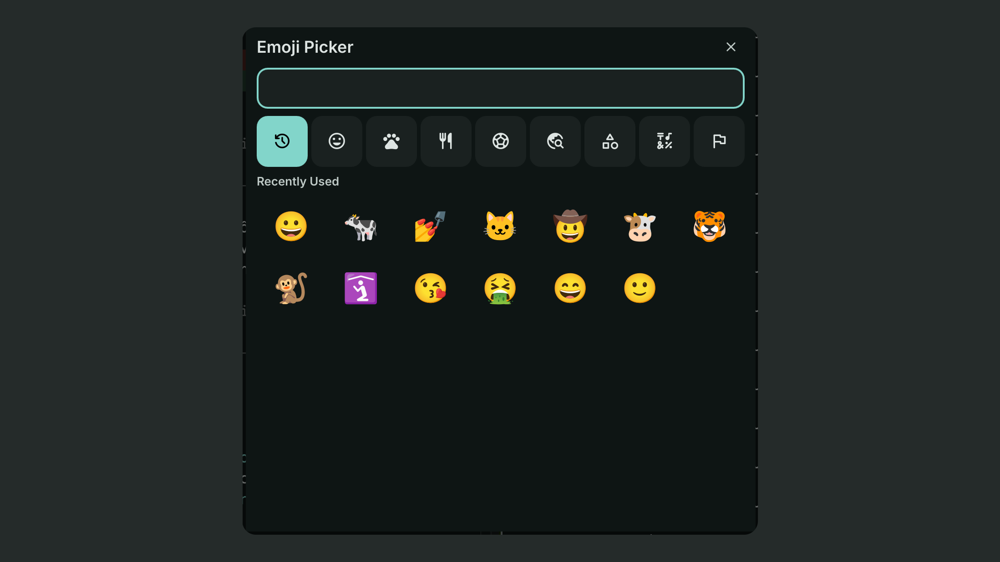

# Emoji Picker

A centered emoji picker for searching, copying, and pasting emoji in DankMaterialShell.


## Installation

Open DMS Settings → Plugins, find **Emoji Picker**, then install and enable it.

## Usage

Bind this command to a compositor shortcut:

```bash
dms ipc call emojiPicker toggle
```

Additional commands:

```bash
dms ipc call emojiPicker open
dms ipc call emojiPicker close
```

## Controls

| Input | Action |
| --- | --- |
| Left click | Copy emoji |
| Right click | Copy and paste emoji |
| Shift+left click | Add emoji to the composition queue |
| Shift+Enter | Add selected emoji to the composition queue |
| Enter | Copy queued emojis, or the selected emoji when the queue is empty |
| Ctrl+Enter | Copy and paste queued emojis, or the selected emoji when the queue is empty |
| Backspace | Remove the last queued emoji when the grid is focused or search is empty |
| Down / Tab from search | Focus the first emoji |
| Arrow keys | Navigate the emoji grid |
| Up from the first row | Return to search |
| Escape | Discard a non-empty queue; close the picker when the queue is empty |

### Categories

| Shortcut | Category |
| --- | --- |
| Ctrl+\` | Recently Used |
| Ctrl+1 | Smileys & People |
| Ctrl+2 | Animals & Nature |
| Ctrl+3 | Food & Drink |
| Ctrl+4 | Activities |
| Ctrl+Q | Travel & Places |
| Ctrl+W | Objects |
| Ctrl+E | Symbols |
| Ctrl+R | Flags |

## Settings

Open DMS Settings → Plugins → Emoji Picker to change:

- Default category
- Picker size
- Recent history size
- Copy confirmation toast

## Credits

- [Emote](https://github.com/tom-james-watson/emote) for the emoji catalog and inspiration
- [OpenMoji](https://openmoji.org/) for the emoji metadata credited by Emote

See [ATTRIBUTION.txt](ATTRIBUTION.txt) and [LICENSE-EMOTE.md](LICENSE-EMOTE.md) for attribution and licensing details.

## License

GPL-3.0-or-later.


## Translations

<!-- TRANSLATIONS_TABLE_START -->
| Language | Locale | Progress | Coverage | Status |
| :--- | :--- | :---: | :---: | :---: |
| Arabic | `ar` | 48/48 | 100.0% | 🟢 Complete |
| Bulgarian | `bg` | 48/48 | 100.0% | 🟢 Complete |
| German | `de` | 48/48 | 100.0% | 🟢 Complete |
| Esperanto | `eo` | 48/48 | 100.0% | 🟢 Complete |
| Spanish | `es` | 48/48 | 100.0% | 🟢 Complete |
| Persian | `fa` | 48/48 | 100.0% | 🟢 Complete |
| French | `fr` | 48/48 | 100.0% | 🟢 Complete |
| Hebrew | `he` | 48/48 | 100.0% | 🟢 Complete |
| Hungarian | `hu` | 48/48 | 100.0% | 🟢 Complete |
| Italian | `it` | 48/48 | 100.0% | 🟢 Complete |
| Japanese | `ja` | 48/48 | 100.0% | 🟢 Complete |
| Korean | `ko` | 48/48 | 100.0% | 🟢 Complete |
| Dutch | `nl` | 48/48 | 100.0% | 🟢 Complete |
| Polish | `pl` | 48/48 | 100.0% | 🟢 Complete |
| Portuguese | `pt` | 48/48 | 100.0% | 🟢 Complete |
| Russian | `ru` | 48/48 | 100.0% | 🟢 Complete |
| Swedish | `sv` | 48/48 | 100.0% | 🟢 Complete |
| Turkish | `tr` | 48/48 | 100.0% | 🟢 Complete |
| Ukrainian | `uk` | 48/48 | 100.0% | 🟢 Complete |
| Vietnamese | `vi` | 48/48 | 100.0% | 🟢 Complete |
| Chinese (Simplified) | `zh_CN` | 48/48 | 100.0% | 🟢 Complete |
| Chinese (Traditional) | `zh_TW` | 48/48 | 100.0% | 🟢 Complete |
<!-- TRANSLATIONS_TABLE_END -->
