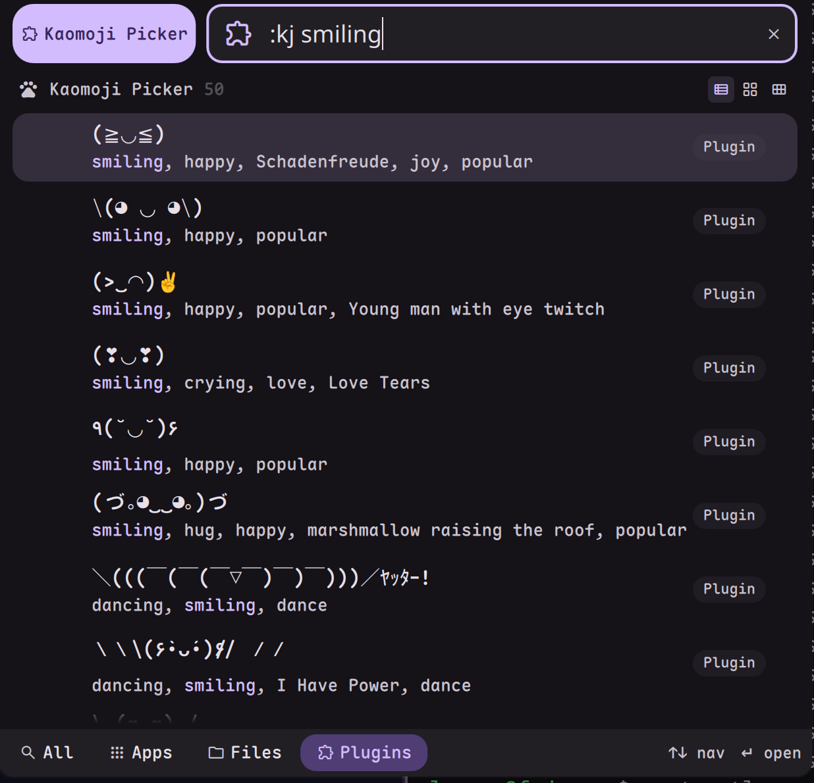

# Kaomoji Picker

Browse and copy kaomoji (Japanese emoticons) directly to your clipboard.



## Install

Use the DMS CLI:
```bash
dms plugins install kaomojiPicker
```

Or manually:
```bash
git clone https://github.com/hthienloc/dms-kaomoji-picker ~/.config/DankMaterialShell/plugins/kaomojiPicker
```

## Features

- **3000+ kaomoji** - Comprehensive local database
- **Fuzzy search** - Filter by tags like `happy`, `sad`, `angry`, `bear`
- **Native copy** - One click to clipboard

## Usage

| Action | Result |
|--------|--------|
| Type `kj` in launcher | Open kaomoji picker |
| Right-click on kaomoji | Pin / Unpin / Remove from history |

## Requirements

- `wtype` - Simulated Wayland keystrokes for Paste on Select (Optional)

## License

MIT

## Roadmap / TODO

- [ ] **Categorical Navigation:** UI for browsing emoticons by mood/type (e.g., Happy, Sad, Animals, Action) instead of just searching.
- [ ] **Custom Additions:** Ability to save personal/unique emoticons directly from the UI or settings.
- [ ] **Binary Storage/Indexing:** Migrate from large JSON to a faster indexed format (SQLite or similar) for near-instant search response.
- [x] **Favorites & Pinning:** Support for permanent favorites that stay at the top regardless of usage frequency.
- [x] **Direct Injection:** Option to paste the selected kaomoji directly into the active window (utilizes `wtype` / `ydotool` / `xdotool`).