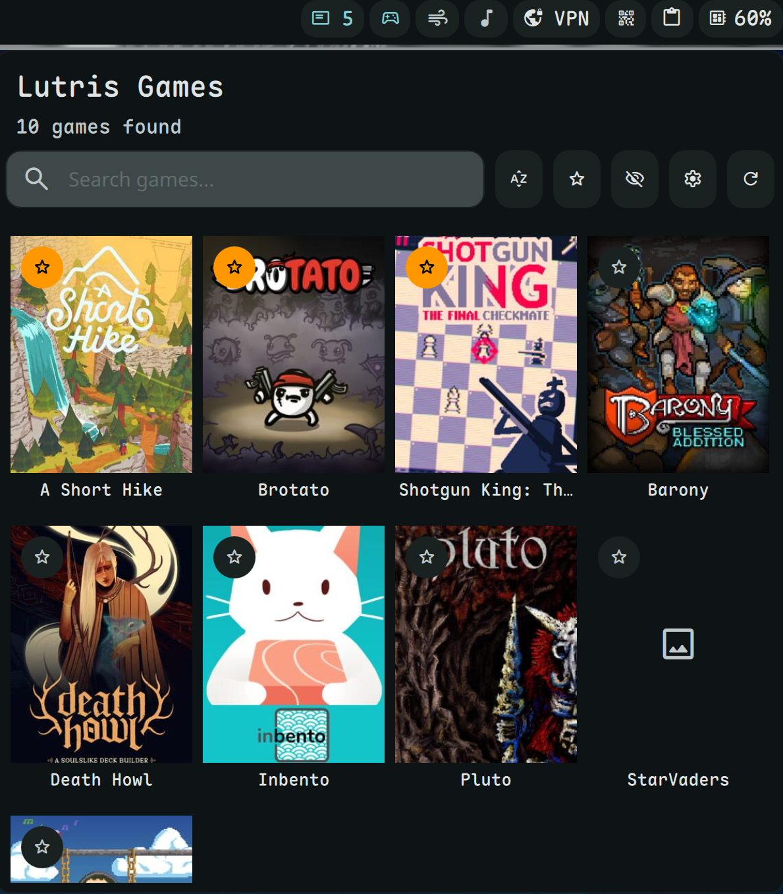

# Lutris Launcher

Browse and launch your Lutris games from the bar.



## Install

Use the DMS CLI:
```bash
dms plugins install lutrisLauncher
```

Or manually:
```bash
git clone https://github.com/hthienloc/dms-lutris-launcher ~/.config/DankMaterialShell/plugins/lutrisLauncher
```

## Features

- **Game grid** - Visual cover art display
- **Sort & filter** - By name, recently played, most played
- **Favorites & blacklist** - Organize your library
- **Launch stats** - Track play time and last played

## Usage

| Action | Result |
|--------|--------|
| Left click | Launch game |
| Right click | Show stats & hide option |

## Requirements

- `lutris` - Game launcher CLI

## License

GPL-3.0

## Roadmap / TODO

- [ ] **Runner Identification**: Display platform badges (e.g., Wine, Steam, Epic, GOG) on game cards to quickly identify the runner.
- [ ] **SteamGridDB Sync**: Integrate with the SteamGridDB API to automatically fetch missing or high-resolution cover art for your library.
- [ ] **Real-time Status Tracking**: Monitor and display "Now Playing" status on the bar widget when a game process is active.
- [ ] **Quick Process Actions**: Add "Kill Process" and "Open Game Folder" options to the game management menu.
- [ ] **Categorization**: Support user-defined categories/tags to further organize large game libraries beyond simple favorites.


## Translations

<!-- TRANSLATIONS_TABLE_START -->
| Language | Locale | Progress | Coverage | Status |
| :--- | :--- | :---: | :---: | :---: |
| Arabic | `ar` | 24/24 | 100.0% | 🟢 Complete |
| Bulgarian | `bg` | 24/24 | 100.0% | 🟢 Complete |
| German | `de` | 24/24 | 100.0% | 🟢 Complete |
| Esperanto | `eo` | 24/24 | 100.0% | 🟢 Complete |
| Spanish | `es` | 24/24 | 100.0% | 🟢 Complete |
| Persian | `fa` | 24/24 | 100.0% | 🟢 Complete |
| French | `fr` | 24/24 | 100.0% | 🟢 Complete |
| Hebrew | `he` | 24/24 | 100.0% | 🟢 Complete |
| Hungarian | `hu` | 24/24 | 100.0% | 🟢 Complete |
| Italian | `it` | 24/24 | 100.0% | 🟢 Complete |
| Japanese | `ja` | 24/24 | 100.0% | 🟢 Complete |
| Korean | `ko` | 24/24 | 100.0% | 🟢 Complete |
| Dutch | `nl` | 24/24 | 100.0% | 🟢 Complete |
| Polish | `pl` | 24/24 | 100.0% | 🟢 Complete |
| Portuguese | `pt` | 24/24 | 100.0% | 🟢 Complete |
| Russian | `ru` | 24/24 | 100.0% | 🟢 Complete |
| Swedish | `sv` | 24/24 | 100.0% | 🟢 Complete |
| Turkish | `tr` | 24/24 | 100.0% | 🟢 Complete |
| Ukrainian | `uk` | 24/24 | 100.0% | 🟢 Complete |
| Vietnamese | `vi` | 24/24 | 100.0% | 🟢 Complete |
| Chinese (Simplified) | `zh_CN` | 24/24 | 100.0% | 🟢 Complete |
| Chinese (Traditional) | `zh_TW` | 24/24 | 100.0% | 🟢 Complete |
<!-- TRANSLATIONS_TABLE_END -->
