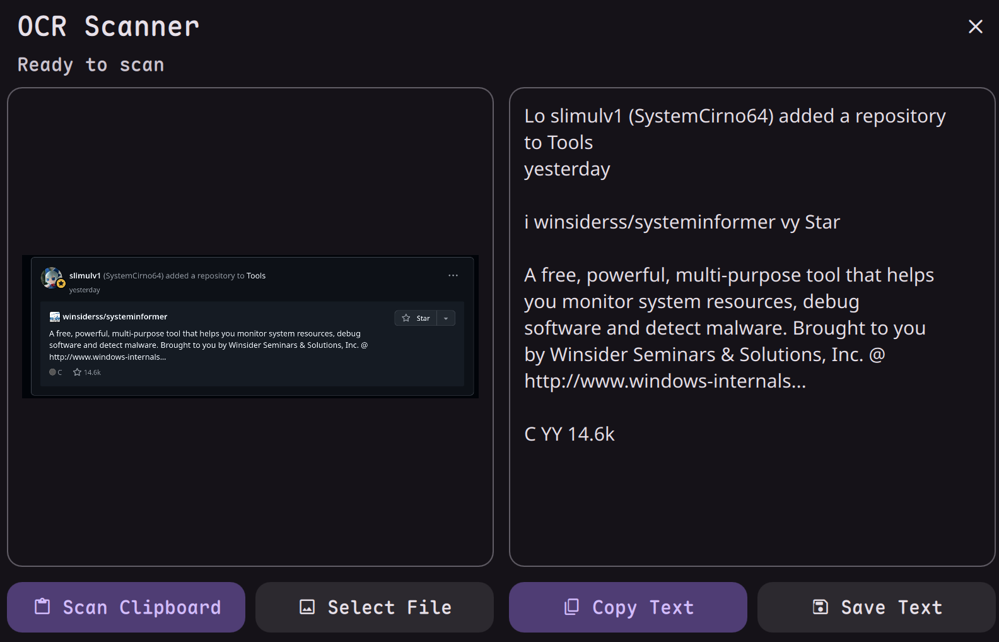

# OCR Scanner

Extract text from images using Tesseract OCR.



## Install

Use the DMS CLI:
```bash
dms plugins install ocrScanner
```

Or manually:
```bash
git clone https://github.com/hthienloc/dms-ocr-scanner ~/.config/DankMaterialShell/plugins/ocrScanner
```

## Features

- **Screenshot OCR** - Middle-click the icon to capture a screen region and scan it instantly
- **Persistent History** - Save and browse previous scans with images and text
- **Clipboard scan** - One-click to extract text from a clipboard image (right-click)
- **Multi-language** - English, Vietnamese, and 100+ other languages
- **Auto-copy** - Extracted text automatically copied to clipboard
- **Save to file** - Export as .txt

## Usage

| Action | Result |
|--------|--------|
| Left click | Open scanner |
| Middle click | Scan from screenshot (region) |
| Right click | Scan from clipboard |

## Requirements

| Package | Installation |
|---------|--------------|
| `tesseract` | `sudo dnf install tesseract` / `sudo pacman -S tesseract` |
| `tesseract-data-*` | Language packs (e.g., `tesseract-langpack-eng`) |

## License

GPL-3.0

## Roadmap / TODO

- [x] **Screenshot OCR**: Capture and scan portions of the screen directly using the DMS screenshot tool.
- [x] **Persistent History**: Implement a local database to store previous scans, including timestamps and source image references.
- [ ] **On-device Translation**: Integrate a lightweight translation service (or API) to translate extracted text instantly.
- [ ] **Batch Processing**: Support selecting multiple images for sequential OCR with a merged text output.
- [ ] **Advanced Tesseract Options**: Expose Page Segmentation Method (PSM) and OCR Engine Mode (OEM) settings in the UI for specialized documents.
- [ ] **Image Preprocessing**: Improve recognition accuracy by using ImageMagick to upscale small text, normalize contrast, and reduce noise before scanning.


## Translations

<!-- TRANSLATIONS_TABLE_START -->
| Language | Locale | Progress | Coverage | Status |
| :--- | :--- | :---: | :---: | :---: |
| Arabic | `ar` | 21/21 | 100.0% | 🟢 Complete |
| Bulgarian | `bg` | 21/21 | 100.0% | 🟢 Complete |
| German | `de` | 21/21 | 100.0% | 🟢 Complete |
| Esperanto | `eo` | 21/21 | 100.0% | 🟢 Complete |
| Spanish | `es` | 21/21 | 100.0% | 🟢 Complete |
| Persian | `fa` | 21/21 | 100.0% | 🟢 Complete |
| French | `fr` | 21/21 | 100.0% | 🟢 Complete |
| Hebrew | `he` | 21/21 | 100.0% | 🟢 Complete |
| Hungarian | `hu` | 21/21 | 100.0% | 🟢 Complete |
| Italian | `it` | 21/21 | 100.0% | 🟢 Complete |
| Japanese | `ja` | 21/21 | 100.0% | 🟢 Complete |
| Korean | `ko` | 21/21 | 100.0% | 🟢 Complete |
| Dutch | `nl` | 21/21 | 100.0% | 🟢 Complete |
| Polish | `pl` | 21/21 | 100.0% | 🟢 Complete |
| Portuguese | `pt` | 21/21 | 100.0% | 🟢 Complete |
| Russian | `ru` | 21/21 | 100.0% | 🟢 Complete |
| Swedish | `sv` | 21/21 | 100.0% | 🟢 Complete |
| Turkish | `tr` | 21/21 | 100.0% | 🟢 Complete |
| Ukrainian | `uk` | 21/21 | 100.0% | 🟢 Complete |
| Vietnamese | `vi` | 21/21 | 100.0% | 🟢 Complete |
| Chinese (Simplified) | `zh_CN` | 21/21 | 100.0% | 🟢 Complete |
| Chinese (Traditional) | `zh_TW` | 21/21 | 100.0% | 🟢 Complete |
<!-- TRANSLATIONS_TABLE_END -->
